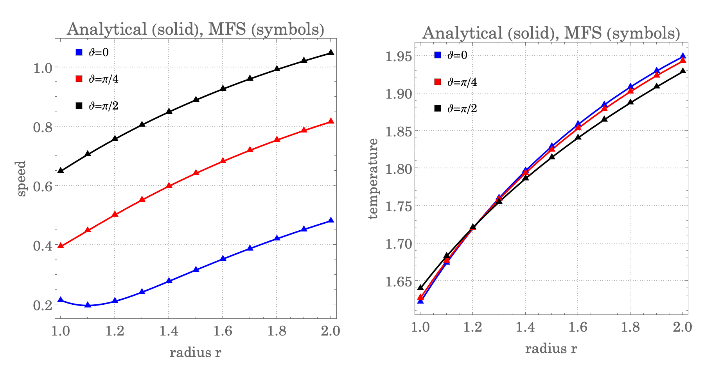
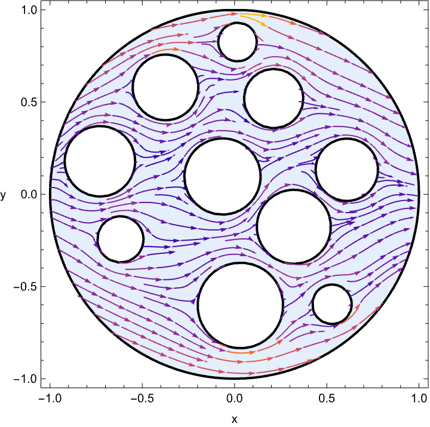

# R13_MFS

## Introduction
This repository contains Wolfram Script implementations of the method of fundamental solutions (MFS) for solving the regularized 13-moment (R13) equations in rarefied gas flows. The scripts provide a meshless approach to solving boundary value problems efficiently. Additionally, the repository includes an analytic solution for the R13 equations and validates the MFS results by comparing them with the analytic results.

For mathematical details see the arXiv preprint [A generalized fundamental solution technique for the regularized 13-moment system in rarefied gas flows](https://arxiv.org/abs/2504.18261).

## Installation
To run the scripts, you need to install the Wolfram Engine and sign in with a free Wolfram account.

### **Step 1: Install Wolfram Engine**
### **Step 1: Install Wolfram Engine and `wolframscript`**
1. Download and install the **Wolfram Engine** from the official website: [Wolfram Engine](https://www.wolfram.com/engine/)
2. The installation includes `wolframscript`, a command-line tool for running Wolfram Language code. After installation:
   - Make sure `wolframscript` is accessible from your terminal. If you get a "command not found" error, add the Wolfram Engine's `Executables` folder to your system `PATH`.
3. Once `wolframscript` is available, authenticate using your Wolfram account:
   ```bash
   wolframscript -authenticate
   ```

### **Step 2: Verify Installation**
To check if the installation was successful, run the following command in the terminal:
```bash
wolframscript -version
```
If the command returns a version number, the installation was successful.

### **Step 3: Install Git**
If Git is not already installed on your system, install it:
- **Linux (Debian/Ubuntu)**: `sudo apt install git`
- **MacOS**: `brew install git`
- **Windows**: Download and install from [git-scm.com](https://git-scm.com/)


## Running the Code

### **Step 1: Clone the Repository**
If you have Git installed, clone the repository:
```bash
git clone https://github.com/himanshikhungar/R13_MFS.git
cd R13_MFS/MFS_WolframCode
```

### **Alternatively: Download Manually**
1. Go to [GitHub Repository](https://github.com/himanshikhungar/R13_MFS).
2. Click on the **“Code”** button and select **“Download ZIP”**.
3. Extract the ZIP file to a folder (e.g., `R13_MFS`).
4. Open a terminal and navigate to the script folder:
   ```bash
   cd R13_MFS/MFS_WolframCode
   ```

### **Step 2: Run the Main Script**
Execute the Wolfram Script by running:
```bash
wolframscript -f ExampleMain.wls
```

This will start the computation using the provided example script, which solves R13 on a 2D geometry given
by two concentric circles. After execution the script will write a PNG image into the local folder which shows the 
comparison of the values of an exact solution with those obtained from MFS.



### **Step 3: Run a Complex Example**
```bash
wolframscript -f RandomMain.wls
```
This will simulate flow past randomly distributed circular obstacles.


## Modifying Parameters
To customize the parameters for your simulation, modify the following values in the respective script files:

1. **Modify the Location of Singularity or Source Points**
   - Change the value of the dilation parameter `α` in `MFS_Example.wls`, see [here](MFS_WolframCode/Example/MFS_Example.wls#L13).

2. **Change the Spacing Between Boundary Nodes and Singularity Points**
   - Modify the grid spacing `d` in `MFS_Solution.wls`, see [here](MFS_WolframCode/Example/MFS_Solution.wls#L17).

3. **Modify Boundary Parameters**
   - To change velocity, temperature, and pressure at boundaries, edit the boundary parameters in `ExampleMain.wls`, see [here](MFS_WolframCode/Example/ExampleMain.wls#L15).

## Contact
For questions or suggestions, please open an issue on GitHub or contact hkhungar@gmail.com.


